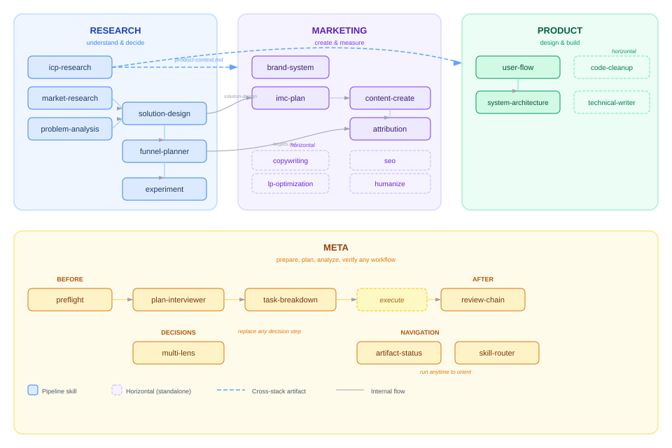
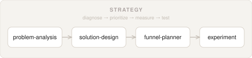
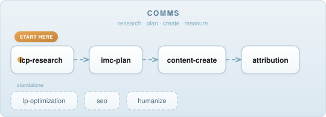
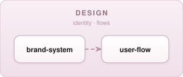
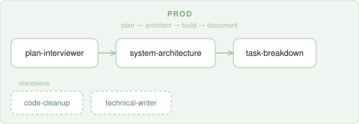

# Agent Skills

19 skills for [Claude Code](https://docs.anthropic.com/en/docs/claude-code) that chain together — from problem diagnosis to shipped code.

Each skill writes structured artifacts to `.agents/`. Downstream skills read those artifacts automatically, so output compounds as you move through the stack.

## How It Works

<picture>
  
</picture>

## Install

```bash
npx skills add hungv47/comms-skills
npx skills add hungv47/design-skills
npx skills add hungv47/prod-skills
npx skills add hungv47/strategy-skills
```

Update all skills:

```bash
npx skills update
```

Remove a skill pack:

```bash
npx skills remove hungv47/comms-skills
```

## Skill Stacks

### Strategy — diagnose, prioritize, measure, test

<picture>
  
</picture>

| Skill | What it does |
|-------|-------------|
| `problem-analysis` | Structured diagnosis, hypothesis development, root cause analysis |
| `solution-design` | Brainstorm solutions, rank with evidence-backed ICE scoring |
| `funnel-planner` | Measurable targets with benchmarks and unit economics |
| `experiment` | Minimum viable tests with clear decision rules |

### Comms — research, plan, create, measure

<picture>
  
</picture>

| Skill | What it does |
|-------|-------------|
| `icp-research` | Deep audience research and Ideal Customer Profile development |
| `imc-plan` | Integrated Marketing Communication planning |
| `content-create` | Production-ready platform-native content assets with A/B variants |
| `attribution` | KPI-initiative-content mapping and coverage audit |
| `copywriting` | Craft-quality copy — headlines, hooks, CTAs, full-page copy with annotations |
| `lp-optimization` | High-conversion landing page optimization |
| `seo` | Technical audit, AI/GEO optimization, programmatic SEO |
| `humanize` | Strip AI patterns, inject voice, compress for density |

### Design — brand, flows

<picture>
  
</picture>

| Skill | What it does |
|-------|-------------|
| `brand-system` | Brand identity — strategy, personality, voice, visual identity, tokens |
| `user-flow` | User flow diagrams and wireflows for digital products |

### Prod — plan, architect, build, document

<picture>
  
</picture>

| Skill | What it does |
|-------|-------------|
| `plan-interviewer` | Multi-round interviews to surface requirements |
| `system-architecture` | Product docs → comprehensive technical blueprints |
| `task-breakdown` | Break implementation into granular, testable tasks |
| `code-cleanup` | Structural cleanup, AI slop removal, refactoring |
| `technical-writer` | Generate documentation and user guides from codebases |

## Example: Idea → Shipped Product

A typical end-to-end workflow:

```
1.  /icp-research        → understand your audience (creates product-context.md)
2.  /problem-analysis     → diagnose the core problem
3.  /solution-design      → prioritize what to build
4.  /funnel-planner       → set targets
5.  /brand-system         → define visual identity
6.  /user-flow            → map the screens
7.  /plan-interviewer     → sharpen the spec
8.  /system-architecture  → design the technical blueprint
9.  /task-breakdown       → create buildable tasks
10. /content-create       → write launch content
11. /lp-optimization      → optimize the landing page
12. /experiment           → design the validation test
```

Each step reads artifacts from previous steps — no copy-pasting between tools.

## Shared Artifacts

Skills communicate through markdown files in `.agents/`:

| Artifact | Created by | Used by |
|----------|-----------|---------|
| `product-context.md` | `icp-research` | 12+ skills across all stacks |
| `solution-design.md` | `solution-design` | `imc-plan`, `system-architecture` |
| `targets.md` | `funnel-planner` | `attribution`, `imc-plan` |
| `design/user-flow.md` | `user-flow` | `system-architecture`, `task-breakdown` |
| `design/brand-system.md` | `brand-system` | `content-create`, `lp-optimization` |

## License

MIT
