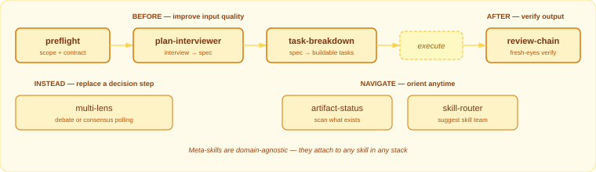

# Agent Skills

25 skills for [AI agents](https://agentskills.io/home) that chain together — from problem diagnosis to shipped code.

Each skill writes structured artifacts to `.agents/`. Downstream skills read those artifacts automatically, so output compounds as you move through the stack.

## How It Works

<picture>
  
</picture>

## Install

```bash
npx skills add hungv47/research-skills
npx skills add hungv47/marketing-skills
npx skills add hungv47/product-skills
npx skills add hungv47/meta-skills
```

## Skill Stacks

### Research — understand your market and decide what to do

> [`hungv47/research-skills`](https://github.com/hungv47/research-skills) &middot; 6 skills

<picture>
  
</picture>

| Skill | What it does | Use when... |
|-------|-------------|-------------|
| `icp-research` | Builds ideal customer profiles — demographics, pain points, jobs-to-be-done, segmentation | You're entering a new market, launching a product, or need to understand who you're building for |
| `market-research` | Maps competitive landscape, TAM/SAM/SOM sizing, whitespace opportunities | You need to size an opportunity, understand competitors, or find market gaps |
| `problem-analysis` | Structured diagnosis — logic trees, hypotheses, root cause analysis | A metric dropped, something broke, or you need to figure out *why* before jumping to solutions |
| `solution-design` | Generates strategic options, scores trade-offs with ICE, recommends a path | The problem is clear and you need to decide *what* to build or pursue |
| `funnel-planner` | Backward funnel modeling — revenue goals to traffic, conversions, unit economics | You need numeric targets: "how much traffic do we need to hit $X ARR?" |
| `experiment` | Designs minimum viable tests with sample sizes and decision rules | You have an initiative and want to validate it before full commitment |

### Marketing — create, optimize, and measure marketing

> [`hungv47/marketing-skills`](https://github.com/hungv47/marketing-skills) &middot; 8 skills

<picture>
  
</picture>

| Skill | What it does | Use when... |
|-------|-------------|-------------|
| `brand-system` | Brand identity — color palettes, typography, design tokens, voice, visual language | You need a visual identity system before creating any marketing materials |
| `imc-plan` | Channel strategy, positioning, content calendar, budget allocation, GTM timelines | You're planning a campaign or go-to-market and need to decide where, when, and how much |
| `content-create` | Drafts social posts, ads, emails, blogs, case studies, video scripts | You need a specific content asset in a platform-native format |
| `copywriting` | Headlines, hooks, CTAs, taglines, full-page section copy with scoring | You need persuasive copy for any surface — landing pages, ads, emails, product UI |
| `lp-optimization` | Conversion audit — hero, CTA, social proof, objection handling | You have a landing page and want to improve its conversion rate |
| `seo` | Technical audit, AI/GEO optimization, programmatic SEO, ASO | You want more organic traffic — search, AI answers, or app store visibility |
| `attribution` | Maps marketing activities to business outcomes, evaluates channel ROI | You're spending on marketing and need to know what's actually working |
| `humanize` | Strips AI patterns, injects brand voice, compresses for density | You have AI-generated text that sounds robotic and needs to read human |

### Product — design and build software

> [`hungv47/product-skills`](https://github.com/hungv47/product-skills) &middot; 4 skills

<picture>
  
</picture>

| Skill | What it does | Use when... |
|-------|-------------|-------------|
| `user-flow` | Maps screens, decisions, transitions, edge cases, and error states | You're designing a feature and need to think through every screen and path |
| `system-architecture` | Technical blueprints — tech stack, database schema, API design, file structure, deployment | You know what to build and need to decide *how* — the technical design |
| `code-cleanup` | Structural audit, AI slop removal, dead code, refactoring | Your codebase has accumulated cruft and needs a quality pass |
| `technical-writer` | READMEs, API references, setup guides, runbooks from existing code | You have a codebase and need documentation generated from it |

### Meta — prepare, plan, analyze, verify any workflow

> [`hungv47/meta-skills`](https://github.com/hungv47/meta-skills) &middot; 7 skills

<picture>
  
</picture>

| Skill | What it does | Use when... |
|-------|-------------|-------------|
| `preflight` | Surfaces assumptions and defines a 4-part success contract (GOAL/CONSTRAINTS/FORMAT/FAILURE) | You're about to build something and want to catch blind spots first |
| `plan-interviewer` | Multi-round interview to turn a vague idea into a structured spec | You have a fuzzy idea and need an AI to grill you into a concrete spec |
| `task-breakdown` | Decomposes a spec into granular, testable tasks with acceptance criteria | You have an architecture or spec and need a buildable task list |
| `multi-lens` | Multi-agent debate (argue in rounds) or consensus polling (independent analysis) | You're facing a decision and want multiple perspectives before committing |
| `review-chain` | Fresh-eyes review — implement, review, resolve. Max 2 rounds | You've built something and want an independent quality check |
| `artifact-status` | Scans `.agents/` — reports what exists, what's stale, what to run next | You're mid-project and need to know where you are and what to do next |
| `skill-router` | Analyzes a goal, suggests the right skill team, orchestrates multi-phase workflows | You have a goal but don't know which skills to run or in what order |

Meta-skills are domain-agnostic process wrappers. They compose with any skill in any stack.

## When to Use What

Not sure which skill to run? Find your situation:

| Situation | Run this |
|-----------|----------|
| "Who are we building for?" | `/icp-research` |
| "How big is this market?" | `/market-research` |
| "Why did this metric drop?" | `/problem-analysis` |
| "What should we build?" | `/solution-design` |
| "How much traffic do we need?" | `/funnel-planner` |
| "Will this idea work?" | `/experiment` |
| "We need a brand identity" | `/brand-system` |
| "Plan the launch campaign" | `/imc-plan` |
| "Write a LinkedIn post / email / blog" | `/content-create` |
| "Write better headlines" | `/copywriting` |
| "Our landing page isn't converting" | `/lp-optimization` |
| "We need more organic traffic" | `/seo` |
| "What marketing is working?" | `/attribution` |
| "This reads like AI wrote it" | `/humanize` |
| "Map the screens for this feature" | `/user-flow` |
| "Design the technical system" | `/system-architecture` |
| "This codebase needs cleanup" | `/code-cleanup` |
| "Generate docs from the code" | `/technical-writer` |
| "Scope this before building" | `/preflight` |
| "Help me think through this idea" | `/plan-interviewer` |
| "Break this into tasks" | `/task-breakdown` |
| "Debate this decision" | `/multi-lens` |
| "Verify this output" | `/review-chain` |
| "What artifacts do I have?" | `/artifact-status` |
| "I have a goal, what do I run?" | `/skill-router "your goal"` |

## Example: Idea to Shipped Product

Run `/skill-router "your goal"` to get a recommended skill team, or follow this end-to-end workflow:

```
 1. /icp-research        → understand your audience
 2. /market-research      → map the competitive landscape
 3. /problem-analysis     → diagnose the core problem
 4. /solution-design      → prioritize what to build
 5. /funnel-planner       → set numeric targets
 6. /brand-system         → define visual identity
 7. /user-flow            → map the screens
 8. /preflight            → surface assumptions, define contract
 9. /plan-interviewer     → sharpen the spec
10. /system-architecture  → design the technical blueprint
11. /task-breakdown       → create buildable tasks
12. /copywriting          → write headlines, hooks, CTAs
13. /content-create       → write launch content
14. /lp-optimization      → optimize the landing page
15. /experiment           → design the validation test
```

Each step reads artifacts from previous steps — no copy-pasting between tools.

## How Skills Communicate

Skills pass data through markdown files in `.agents/`:

| Artifact | Produced by | Consumed by |
|----------|------------|-------------|
| `product-context.md` | `icp-research` | 12+ skills across all stacks |
| `market-research.md` | `market-research` | `solution-design` |
| `problem-analysis.md` | `problem-analysis` | `solution-design` |
| `solution-design.md` | `solution-design` | `imc-plan`, `system-architecture`, `funnel-planner` |
| `targets.md` | `funnel-planner` | `attribution`, `experiment` |
| `design/brand-system.md` | `brand-system` | Visual decisions in content and landing pages |
| `mkt/imc-plan.md` | `imc-plan` | `content-create`, `copywriting`, `seo`, `attribution` |
| `mkt/content/[slug].md` | `content-create` | `humanize`, `attribution` |
| `design/user-flow.md` | `user-flow` | `system-architecture`, `task-breakdown` |
| `spec.md` | `plan-interviewer` | `system-architecture`, `task-breakdown` |
| `system-architecture.md` | `system-architecture` | `task-breakdown` |
| `tasks.md` | `task-breakdown` | Task execution |

Every artifact includes frontmatter with `skill`, `version`, `date`, and `status` fields for traceability.

## Architecture

Most skills use a **two-layer multi-agent orchestration** pattern:

```
SKILL.md (Orchestrator)
  ├─ Layer 1: Parallel specialists ──── run concurrently
  ├─ Merge Step ──────────────────────── assemble outputs
  ├─ Layer 2: Sequential refiners ───── run in order
  └─ Critic Agent ────────────────────── PASS / FAIL (max 2 cycles)
```

**~139 specialized agents** across domain skills. Meta-skills use two additional patterns: **dynamic agent spawning** (`multi-lens`, `review-chain`) and **methodology** (`preflight`, `artifact-status`).

## License

MIT
