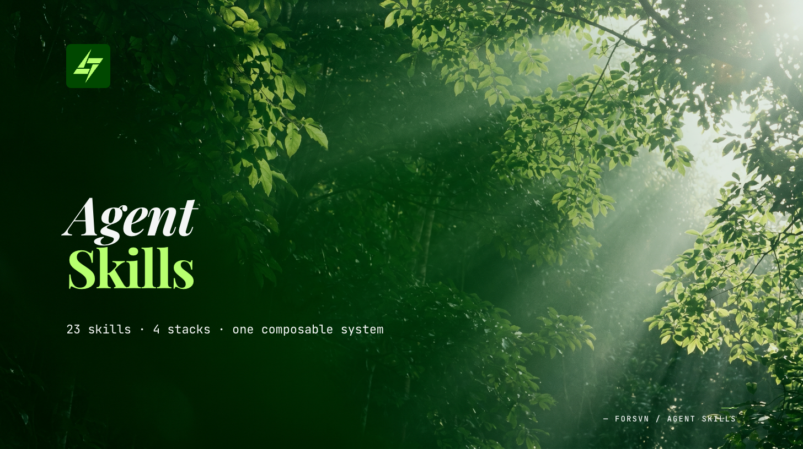
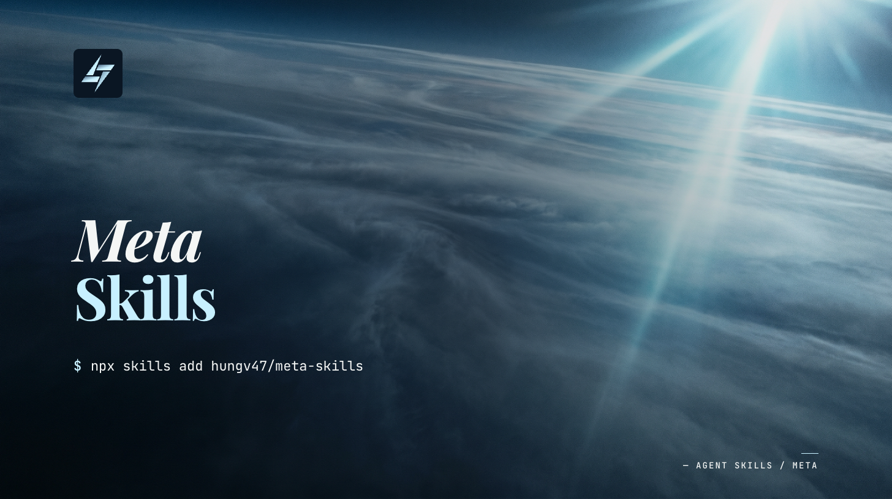

# Agent Skills



A composable skill stack for [AI agents](https://agentskills.io/home) that chains together — from problem diagnosis to shipped code.

Skills pass context through conversation and optional artifacts in `.agents/`. Downstream skills read conversation context or artifacts automatically, so output compounds as you move through the stack.

## Install

Installs via the [`skills` CLI](https://skills.sh). Requires Node.js 18+. Works with Claude Code, Cursor, Codex, Windsurf, Gemini CLI, and VS Code (auto-detects your editor).

### Install a full stack

```bash
npx skills add hungv47/research-skills
npx skills add hungv47/marketing-skills
npx skills add hungv47/product-skills
npx skills add hungv47/meta-skills
```

### Install a single skill

Cherry-pick any skill with `--skill` (the examples below are illustrative — any skill in a stack works):

```bash
npx skills add hungv47/marketing-skills --skill copywriting
npx skills add hungv47/research-skills --skill icp-research
npx skills add hungv47/product-skills --skill system-architecture
npx skills add hungv47/meta-skills --skill fresh-eyes
```

Cherry-pick multiple skills in a single call:

```bash
npx skills add hungv47/marketing-skills --skill copywriting humanize
```

List what's available in a stack without installing:

```bash
npx skills add hungv47/marketing-skills --list
```

### Target a specific editor

Use `--agent` to install into one or more editors. Defaults to auto-detect in the current directory.

```bash
npx skills add hungv47/meta-skills --agent claude-code
npx skills add hungv47/meta-skills --agent claude-code cursor
```

### Install globally

Make a skill available in every project on your machine:

```bash
npx skills add hungv47/meta-skills -g
```

### Other operations

```bash
npx skills list                          # list installed skills
npx skills update                        # update to latest versions
npx skills remove                        # interactive remove by skill name
npx skills find copywriting              # search the skills registry
```

Run `npx skills --help` for the full command reference.

### Alternative: Claude Code plugin marketplace

For Claude Code users who prefer the native plugin system. Install all four packs via marketplace:

```
/plugin marketplace add hungv47/agent-skills
/plugin install research-skills@agent-skills
/plugin install marketing-skills@agent-skills
/plugin install product-skills@agent-skills
/plugin install meta-skills@agent-skills
```

After install, skills are namespaced — call them as `/research-skills:icp-research`, `/marketing-skills:copywriting`, `/product-skills:system-architecture`, `/meta-skills:discover`, etc. Auto-invocation by Claude works the same as standalone skills.

**`npx skills` is the recommended path for most users** — it's editor-agnostic (Claude Code, Cursor, Codex, Windsurf, Gemini CLI, VS Code), supports per-skill cherry-pick (`--skill <name>`), and skills are callable without a namespace prefix. The plugin marketplace is Claude Code only and namespace-scoped, useful mainly if you discover the stack through Claude Code's `/plugin marketplace` browser.

#### Why isn't there one umbrella `agent-skills` plugin to install everything?

The four packs are kept as separate plugins on purpose — research / marketing / product / meta are independent domains with independent release cadences and there's value in installing only the ones you need. The Claude Code plugin model also doesn't have "depends-on" semantics: an umbrella plugin could not declaratively pull in the other four, it would either have to duplicate every skill (bloating updates and breaking provenance) or be empty ceremony. The four-line install above is the honest minimum. If you want true one-command full-stack install, prefer `npx skills add hungv47/research-skills marketing-skills product-skills meta-skills` (the `skills` CLI accepts multiple stacks per call).

## Getting Started

### Fastest path: one stack for your work + meta globally

Pick the stack closest to what you're building, then install meta globally so process skills work in every project:

```bash
# Pick what you're working on
npx skills add hungv47/research-skills      # researching a market or audience
npx skills add hungv47/marketing-skills     # writing copy, planning campaigns, briefing design
npx skills add hungv47/product-skills       # designing or building software

# Always useful — install globally, available everywhere
npx skills add hungv47/meta-skills -g
```

If you're not sure which stack you need, install meta and run `/start-meta` — it reads cross-stack project state and routes you to the right stack-orchestrator (`/start-research`, `/start-marketing`, `/start-product`) or to a process skill (`/discover`, `/agents-panel`, `/task-breakdown`, `/fresh-eyes`).

### Stack orchestrators (don't know which skill to invoke?)

Each stack ships with a `/start-<stack>` orchestrator that reads what's already in `.agents/`, `research/`, and `brand/`, parses your free-form ask, and proposes the next 1–3 skills with rationale + cost + duration. Use these as the entry point when you're new to the stack or returning mid-project:

```
/start-research      # who's the audience? market landscape? prioritization? targets?
/start-marketing     # brand foundation? campaign? copy? LP? SEO? video? outreach?
/start-product       # user flow? architecture? code cleanup? machine cleanup? docs?
/start-meta          # cross-stack — routes to the right /start-X or process skill
```

Each starter never auto-invokes — it always prints the recommended `/skill-name` for you to type, after showing you the rationale. Re-running `/start-X` after a skill completes resumes the workflow.

### How invocation works

Every installed skill becomes a slash command in your editor:

```
/icp-research "B2B project management SaaS for agencies"
/system-architecture "team dashboard with real-time status"
/discover "vague idea I want to flesh out"
/fresh-eyes
```

You don't have to remember names. Type a plain-English request and your agent reads the available skills and proposes the right one. Saying *"help me figure out who we're building for"* surfaces `/icp-research`. Saying *"this codebase has accumulated cruft"* surfaces `/code-cleanup`.

### Pre-Dispatch: skills ask once, remember forever

Most skills bundle 3–7 context questions in a single message before dispatching their sub-agents. Answer all the questions in one reply — the skill is gathering enough context to run multiple agents in parallel.

Answers persist to `.agents/experience/{domain}.md` (product, audience, brand, business, goals, technical). The next skill in the same project reads from this file and skips re-asking. First skill in a project costs 1–2 minutes of setup; everything downstream skips straight to work.

### Where outputs land

Most skills write to `.agents/`. Three folders are top-level because they're canonical records the team owns long-term:

- `research/` — audience and market records (`product-context.md`, `icp-research.md`, `market-research.md`)
- `brand/` — brand identity of record (`BRAND.md`, `DESIGN.md`, `ASSETS.md`)
- `architecture/` — system blueprint of record (`system-architecture.md`, schemas, ADRs)

Everything else (audits, briefs, plans, reports) lives under `.agents/` with topic subfolders (`mkt/`, `product/`, `meta/`, `experience/`).

## Full Pipeline

End-to-end pipeline: meta process wrappers compose with research pipeline skills, product skills (pipeline + horizontal), and marketing skills (pipeline + horizontal).

**30 skills total**: 7 research + 12 marketing + 6 product + 5 meta. Each stack includes a `/start-<stack>` orchestrator that reads project state and routes to the right skill. Research and product pipelines run in sequence; marketing has a pipeline plus horizontal skills (copywriting, humanize, vn-tone, lp-optimization) that apply at any stage. Meta skills are domain-agnostic process wrappers that compose with any skill. Short-form video pipeline: `short-form-research` (research-skills) → `short-form-brief` (marketing-skills).

## Skill Stacks

### Research — understand your market and decide what to do


> [`hungv47/research-skills`](https://github.com/hungv47/research-skills) &middot; 7 skills (incl. `/start-research`)

```
icp-research → market-research + diagnose → prioritize → funnel-planner
short-form-research → .agents/mkt/short-form-research.md (consumed by short-form-brief)
```

| Skill | What it does | Use when... |
|-------|-------------|-------------|
| `icp-research` | Builds ideal customer profiles — demographics, pain points, jobs-to-be-done, segmentation | You're entering a new market, launching a product, or need to understand who you're building for |
| `market-research` | Maps competitive landscape, TAM/SAM/SOM sizing, whitespace opportunities | You need to size an opportunity, understand competitors, or find market gaps |
| `diagnose` | Structured diagnosis — logic trees, hypotheses, root cause analysis | A metric dropped, something broke, or you need to figure out *why* before jumping to solutions |
| `prioritize` | Generates strategic options, scores trade-offs with ICE, recommends a path | The problem is clear and you need to decide *what* to build or pursue |
| `funnel-planner` | Backward funnel modeling — revenue goals to traffic, conversions, unit economics | You need numeric targets: "how much traffic do we need to hit $X ARR?" |

### Marketing — create, optimize, and measure marketing


> [`hungv47/marketing-skills`](https://github.com/hungv47/marketing-skills) &middot; 12 skills (incl. `/start-marketing`)

```
brand-system
  ↓
campaign-plan
  ↓
  ├─ lp-brief (per page)  → design-brief (per asset slot)
  ├─ seo (per mode)
  └─ cold-outreach (per touch)

Audit live pages: lp-optimization → (if redesign warranted) lp-brief
Horizontal: copywriting, humanize, vn-tone — invoked at any stage.
```

| Skill | What it does | Use when... |
|-------|-------------|-------------|
| `brand-system` | Brand identity — color palettes, typography, design tokens, voice, visual language | You need a visual identity system before creating any marketing materials |
| `campaign-plan` | Channel strategy, positioning, content calendar, budget allocation, GTM timelines | You're planning a campaign or go-to-market and need to decide where, when, and how much |
| `copywriting` | Headlines, hooks, CTAs, taglines, full-page section copy with scoring | You need persuasive copy for any surface — landing pages, ads, emails, product UI |
| `lp-optimization` | Conversion audit on a live page — hero, CTA, social proof, objection handling | You have a landing page and want to improve its conversion rate without a redesign |
| `lp-brief` | Campaign-grade redesign brief — hypothesis, architecture, per-section spec, asset slots, hand-off prompts | You're redesigning a landing page and need a brief precise enough for a designer or AI tool to execute |
| `design-brief` | Per-asset graphic-design brief with platform-aware specs (aspect, safe zones, type scale, contrast, file format) and downstream handoff (image-gen prompt / vector-tool spec / designer-handoff) | You need a brief for a single visual asset (IG carousel, OG image, banner ad, YT thumbnail, OOH, etc.) — rendering happens downstream |
| `seo` | Technical audit, AI/AEO optimization, programmatic SEO, ASO | You want more organic traffic — search, AI answers, or app store visibility |
| `humanize` | Strips AI patterns, injects brand voice, compresses for density | You have AI-generated text that sounds robotic and needs to read human |
| `vn-tone` | Polishes translated Vietnamese into a native register (báo chí, semi-casual, bro, or pop-marketing) | You have Vietnamese copy that reads translated/robotic or needs register alignment |
| `cold-outreach` | Cold email / DM / proposal composition with signal-based personalization, channel-specific craft, rubric scoring, terminal humanize pass | You're writing first-touch outbound or replies to inbound responses and want it to read like a sharp human, not a template |

### Product — design and build software


> [`hungv47/product-skills`](https://github.com/hungv47/product-skills) &middot; 6 skills (incl. `/start-product`)

| Skill | What it does | Use when... |
|-------|-------------|-------------|
| `user-flow` | Maps screens, decisions, transitions, edge cases, and error states | You're designing a feature and need to think through every screen and path |
| `system-architecture` | Technical blueprints — tech stack, database schema, API design, file structure, deployment, security review (STRIDE + OWASP + LLM security), dependency classification | You know what to build and need to decide *how* — the technical design |
| `code-cleanup` | Structural audit, AI slop removal (code-level + frontend/visual), dead code, unused assets, refactoring | Your codebase has accumulated cruft and needs a quality pass |
| `machine-cleanup` | Audits and cleans your dev machine — dotfolders, caches, language toolchains, package-manager globals — with risk surfacing (auth, processes, shell-rc) and per-target confirmation | Your machine has accumulated years of toolchains, caches, and SDKs and you want to reclaim disk safely |
| `docs-writing` | READMEs, API references, setup guides, runbooks from existing code. Ship log mode writes product context to `research/product-context.md`. Sync mode for post-change doc updates | You have a codebase and need documentation generated or updated after changes |

### Meta — discover, debate, decompose, verify



> [`hungv47/meta-skills`](https://github.com/hungv47/meta-skills) &middot; 5 skills (incl. `/start-meta`)

| Skill | What it does | Use when... |
|-------|-------------|-------------|
| `discover` | Conversational discovery — adapts from quick scoping (3-5 questions) to deep interviews | You have a vague idea or clear task and want alignment before building |
| `agents-panel` | Multi-agent discussion rooms — debate (argue in rounds) or consensus polling | You're facing a complex decision and want multiple perspectives |
| `task-breakdown` | Decomposes work into granular, testable tasks with acceptance criteria | Work is too big to just start — needs decomposition first |
| `fresh-eyes` | Fresh-eyes review — implement, review, resolve. Max 2 rounds | You've built something and want an independent quality check |

Meta-skills are domain-agnostic process wrappers. They compose with any skill in any stack.

## When to Use What

Not sure which skill to run? Find your situation:

| Situation | Run this |
|-----------|----------|
| "Who are we building for?" | `/icp-research` |
| "How big is this market?" | `/market-research` |
| "Why did this metric drop?" | `/diagnose` |
| "What should we build?" | `/prioritize` |
| "How much traffic do we need?" | `/funnel-planner` |
| "We need a brand identity" | `/brand-system` |
| "Plan the launch campaign" | `/campaign-plan` |
| "Write better headlines / CTAs / taglines" | `/copywriting` |
| "Our landing page isn't converting" | `/lp-optimization` |
| "Brief a landing-page redesign" | `/lp-brief` |
| "Brief a single graphic-design asset (carousel / OG / thumbnail / banner)" | `/design-brief` |
| "We need more organic traffic" | `/seo` |
| "Write a cold email / DM / proposal" | `/cold-outreach` |
| "This reads like AI wrote it" | `/humanize` |
| "Polish Vietnamese that sounds translated" | `/vn-tone` |
| "Map the screens for this feature" | `/user-flow` |
| "Design the technical system" | `/system-architecture` |
| "This codebase needs cleanup" | `/code-cleanup` |
| "Generate docs from the code" | `/docs-writing` |
| "Write a product snapshot for agents" | `/docs-writing --ship-log` |
| "Update docs after this change" | `/docs-writing --sync` |
| "Scope this before building" | `/discover` |
| "Help me think through this idea" | `/discover` |
| "Break this into tasks" | `/task-breakdown` |
| "Debate this decision" | `/agents-panel` |
| "Verify this output" | `/fresh-eyes` |

## Worked Examples: Artifact Flow in Practice

Real workflows are 3-6 skills, not 16. Each example below is a chain users actually run end-to-end in one session.

### Example 1: Research → Marketing Pipeline

```
/icp-research "B2B project management SaaS for agencies"
  └─ writes research/product-context.md (personas, pain points, JTBD)
  └─ writes research/icp-research.md (full audience analysis)

/campaign-plan "Q3 launch campaign"
  ├─ reads research/product-context.md (audience)
  ├─ reads research/icp-research.md (personas)
  └─ writes .agents/mkt/campaign-plan.md (channels, calendar, budget)

/lp-brief "Q3 launch landing page"
  ├─ reads research/product-context.md (voice, audience language)
  ├─ reads brand/BRAND.md + brand/DESIGN.md (visual language, lexicon)
  ├─ reads .agents/mkt/campaign-plan.md (campaign hypothesis, conversion targets)
  └─ writes .agents/mkt/lp-brief/q3-launch/brief.md + asset-slots/*.prompt.md

/design-brief "hero image for q3-launch (slot: hero-image)"
  ├─ reads brand/DESIGN.md (palette, typography, sacred elements)
  ├─ reads .agents/mkt/lp-brief/q3-launch/asset-slots/hero-image.md (slot spec)
  └─ writes .agents/mkt/design-briefs/q3-launch-hero.md (concept + platform spec + image-gen prompt)
```

Each downstream skill produces richer output because it inherits upstream context. The design-brief output references audience pain points from icp-research, messaging pillars from campaign-plan, and the conversion hypothesis from lp-brief — without the user repeating any of it.

### Example 2: Product Pipeline

```
/discover "build a team dashboard with real-time project status"
  └─ conversation produces key decisions (scope, tech choices, edge cases)
  └─ optionally writes .agents/spec.md (if user asks to save; includes FAILURE conditions)

/user-flow "team dashboard"
  ├─ reads .agents/spec.md (if saved) or conversation context
  └─ writes .agents/product/flow/team-dashboard.md (screens, transitions, platform-surface matrix, edge states)

/system-architecture "team dashboard"
  ├─ reads .agents/spec.md (requirements)
  ├─ reads .agents/product/flow/*.md (every flow file; screens and surface matrix inform API design)
  └─ writes architecture/system-architecture.md (stack, schema, API, deployment)

/task-breakdown
  ├─ reads architecture/system-architecture.md (what to build)
  ├─ reads .agents/product/flow/*.md (UX requirements per task across every flow)
  └─ writes .agents/tasks.md (ordered tasks with acceptance criteria)

(build tasks) → /fresh-eyes
```

### Example 3: Multi-Perspective Decision

```
/agents-panel "debate: should we build a Chrome extension or a web app?"
  ├─ spawns 3 agents (Architect, Pragmatist, Critic)
  ├─ 3 rounds of structured debate
  └─ writes .agents/meta/agents-panel-report.md (consensus, splits, recommendation)
```

### Example 4: Diagnose a Declining Metric

```
/diagnose "checkout conversion dropped 30% over the last 6 weeks"
  ├─ reads research/product-context.md (audience baseline)
  ├─ Layer 1 parallel: tree-builder + external-check
  ├─ Layer 2 sequential: hypothesis → data-mapper → verdict → critic
  └─ writes .agents/diagnose.md (root cause + evidence + ranked hypotheses)

/prioritize "checkout fixes from diagnose output"
  ├─ reads .agents/diagnose.md (which causes to address)
  ├─ reads research/product-context.md (audience constraints)
  └─ writes .agents/prioritize.md (ICE-scored fix list with cut line)

/funnel-planner "set checkout recovery targets"
  ├─ reads .agents/prioritize.md (initiatives → metrics)
  └─ writes .agents/targets.md (numeric targets for traffic, CR, revenue)
```

### Example 5: Audit and Rewrite a Landing Page

```
/lp-optimization https://example.com/pricing
  ├─ reads research/product-context.md (audience pain language)
  ├─ Layer 1 parallel: hero-audit + trust-audit + cta-audit + ux-audit
  └─ writes .agents/mkt/lp-optimization.md (specific issues + prioritization)

/lp-brief "/pricing redesign"
  ├─ reads .agents/mkt/lp-optimization.md (what's broken)
  ├─ reads brand/BRAND.md + brand/DESIGN.md (visual + voice)
  └─ writes .agents/mkt/lp-brief/pricing/brief.md + asset-slots/*.prompt.md

/design-brief "hero illustration for pricing (slot: hero-image)"
  ├─ reads brand/DESIGN.md + .agents/mkt/lp-brief/pricing/asset-slots/hero-image.md
  └─ writes .agents/mkt/design-briefs/pricing-hero.md (concept + image-gen prompt)

/copywriting "rate the hero copy candidates from the brief"
  ├─ reads .agents/mkt/lp-brief/pricing/brief.md (copy candidates inline)
  └─ writes .agents/mkt/content/pricing-hero.copy.md (alternatives + rationale)
```

### Example 6: Write a Cold Outbound Sequence

```
/icp-research "founders of seed-stage B2B AI startups"
  └─ writes research/product-context.md + research/icp-research.md (audience, signals, voice)

/cold-outreach "first-touch email to founders of seed AI startups, channel: email"
  ├─ reads research/product-context.md + research/icp-research.md (audience signals)
  ├─ Layer 1: signal-analyst → strategist + proof-selector in parallel
  ├─ Layer 2: composer → voice-auditor → critic → terminal humanize
  └─ writes .agents/mkt/cold-outreach/founder-touch1.md + .rationale.md + .critic-score.md

/cold-outreach "reply to: <prospect's response asking about pricing>"
  ├─ reads .agents/mkt/cold-outreach/founder-touch1.md (prior touch context)
  └─ writes .agents/mkt/cold-outreach/founder-reply1.md (reply + rationale + score)
```

## Tips for Effective Use

**Start with `/discover` for vague work.** "Build something cool" gets nowhere. `/discover` interviews you in 3–8 questions and produces a concrete spec other skills can run on.

**Run `/icp-research` before any marketing work.** It writes `research/product-context.md` — the foundation artifact 12+ downstream skills consume. Skip it and every downstream skill re-asks you for audience details.

**Chain skills, don't one-shot.** A 5-skill chain (icp-research → diagnose → prioritize → campaign-plan → copywriting) produces sharper output than running copywriting alone, because each downstream skill inherits real upstream context. The Worked Examples above show real chains.

**Run `/fresh-eyes` before shipping.** Security-sensitive code and data-mutation work auto-trigger it. Run it manually on marketing copy, briefs, and architecture docs — it catches what you can't see after staring at a draft.

**Let artifacts compound.** `.agents/` and the canonical folders (`research/`, `brand/`, `architecture/`) accumulate across sessions. After a month you have prioritize history, target docs, every copy variant, every design brief — all version-stamped, all referenceable. Don't delete them.

**Edit artifact frontmatter when reality changes.** If `research/product-context.md` says you serve agencies but you've pivoted to enterprise, edit the file directly. Skills read whatever's there now — they don't lock to the original session.

**Answer Pre-Dispatch questions in one reply.** When a skill asks 5 questions in one message, answer all 5 in one response. The skill is bundling so it can dispatch parallel sub-agents — answering one at a time forces it to re-prompt and slows everything down.

**Use horizontal skills late, not early.** `humanize`, `vn-tone`, `copywriting` apply to outputs from any pipeline skill. Run them as a polish pass after the pipeline produces a draft, not as a starting point.

**Override skill recommendations when you have context.** Skills auto-detect the right path (e.g., `design-brief` auto-routes to image-gen vs. vector-tool). If you know better, override with flags or correct in the conversation.

**Install `meta-skills` globally.** They're domain-agnostic. `/discover`, `/agents-panel`, `/task-breakdown`, `/fresh-eyes` are useful in every project on your machine — `npx skills add hungv47/meta-skills -g` is the install most people regret skipping.

## How Skills Communicate

Skills pass data through markdown files in `.agents/`:

| Artifact | Produced by | Consumed by |
|----------|------------|-------------|
| `product-context.md` | `icp-research`, `docs-writing --ship-log` | 12+ skills across all stacks |
| `market-research.md` | `market-research` | `prioritize` |
| `diagnose.md` | `diagnose` | `prioritize` |
| `prioritize.md` | `prioritize` | `campaign-plan`, `system-architecture`, `funnel-planner` |
| `targets.md` | `funnel-planner` | — (terminal until measurement skill exists) |
| `brand/BRAND.md`, `brand/DESIGN.md`, `brand/ASSETS.md` | `brand-system` | Visual decisions in `lp-brief`, `design-brief`, `humanize`, `copywriting` |
| `mkt/campaign-plan.md` | `campaign-plan` | `lp-brief`, `seo`, `cold-outreach`, `copywriting` |
| `mkt/content/[slug].copy.md` | `copywriting` | `humanize`, `vn-tone`, `design-brief` (copy-anchor) |
| `mkt/content/[slug].humanized.md` | `humanize` | `vn-tone` |
| `mkt/content/[slug].vn-tone.md` | `vn-tone` | — (terminal) |
| `mkt/seo-[mode].md` | `seo` | `copywriting`, `lp-optimization` |
| `mkt/lp-optimization.md` | `lp-optimization` | `lp-brief` (when redesign warranted) |
| `mkt/lp-brief/[slug]/brief.md` + `asset-slots/*.prompt.md` | `lp-brief` | `design-brief` (per slot) + external designer / image-gen |
| `mkt/design-briefs/[slug].md` | `design-brief` | External image-gen / vector-tool / human designer |
| `mkt/cold-outreach/[slug].md` | `cold-outreach` | — (terminal) |
| `product/flow/<flow-name>.md` + `product/flow/index.md` | `user-flow` | `system-architecture`, `task-breakdown` |
| `spec.md` | `discover` (optional) | `system-architecture`, `task-breakdown` |
| `system-architecture.md` | `system-architecture` | `task-breakdown` |
| `tasks.md` | `task-breakdown` | Task execution |
| `cleanup-report.md` | `code-cleanup` | — (terminal) |
| `meta/agents-panel-report.md` | `agents-panel` | — (ephemeral) |
| `meta/fresh-eyes-report.md` | `fresh-eyes` | — (terminal) |

Every artifact includes frontmatter with `skill`, `version`, `date`, and `status` fields for traceability.

## Architecture

Most skills use a **two-layer multi-agent orchestration** pattern:

```
SKILL.md (Orchestrator)
  ├─ Layer 1: Parallel specialists ──── run concurrently
  ├─ Merge Step ──────────────────────── assemble outputs
  ├─ Layer 2: Sequential refiners ───── run in order
  └─ Critic Agent ────────────────────── PASS / FAIL (max 2 cycles)
```

**~150 specialized agents** across domain skills. Meta-skills use additional patterns: **dynamic agent spawning** (`agents-panel`, `fresh-eyes`) and **conversation-first discovery** (`discover`).

## Changelog

Per-stack release notes (updated 2026-05-08 — meta-skills v2.3.2 — agents-panel + fresh-eyes body write to dated-slug paths (close v1.5.0 T33 mismatch)):
- [research-skills/CHANGELOG.md](https://github.com/hungv47/research-skills/blob/main/CHANGELOG.md)
- [marketing-skills/CHANGELOG.md](https://github.com/hungv47/marketing-skills/blob/main/CHANGELOG.md)
- [product-skills/CHANGELOG.md](https://github.com/hungv47/product-skills/blob/main/CHANGELOG.md)
- [meta-skills/CHANGELOG.md](https://github.com/hungv47/meta-skills/blob/main/CHANGELOG.md)

## License

MIT
