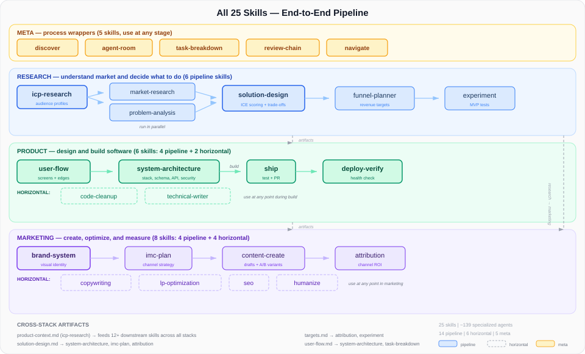
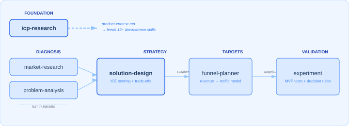
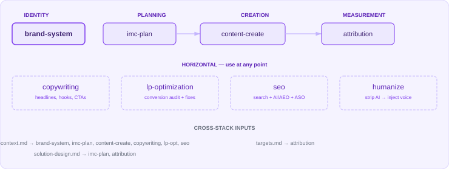
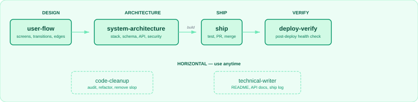

# Agent Skills

A composable skill stack for [AI agents](https://agentskills.io/home) that chains together — from problem diagnosis to shipped code.

Skills pass context through conversation and optional artifacts in `.agents/`. Downstream skills read conversation context or artifacts automatically, so output compounds as you move through the stack.

## Install

Installs via the [`skills` CLI](https://skills.sh). Requires Node.js 18+. Works with Claude Code, Cursor, Codex, Windsurf, Gemini CLI, and VS Code (auto-detects your editor).

### Install a full stack

```bash
npx skills add hungv47/research-skills
npx skills add hungv47/marketing-skills
npx skills add hungv47/product-skills
npx skills add hungv47/meta-skills
```

### Install a single skill

Cherry-pick any skill with `--skill` (the examples below are illustrative — any skill in a stack works):

```bash
npx skills add hungv47/marketing-skills --skill copywriting
npx skills add hungv47/research-skills --skill icp-research
npx skills add hungv47/product-skills --skill ship
npx skills add hungv47/meta-skills --skill review-chain
```

Cherry-pick multiple skills in a single call:

```bash
npx skills add hungv47/marketing-skills --skill copywriting humanize
```

List what's available in a stack without installing:

```bash
npx skills add hungv47/marketing-skills --list
```

### Target a specific editor

Use `--agent` to install into one or more editors. Defaults to auto-detect in the current directory.

```bash
npx skills add hungv47/meta-skills --agent claude-code
npx skills add hungv47/meta-skills --agent claude-code cursor
```

### Install globally

Make a skill available in every project on your machine:

```bash
npx skills add hungv47/meta-skills -g
```

### Other operations

```bash
npx skills list                          # list installed skills
npx skills update                        # update to latest versions
npx skills remove                        # interactive remove by skill name
npx skills find copywriting              # search the skills registry
```

Run `npx skills --help` for the full command reference.

## Full Pipeline

<picture>
  
</picture>

**15 pipeline skills** run in sequence across three phases (Research → Product → Marketing). **7 horizontal skills** apply at any point within their stack. **5 meta skills** are domain-agnostic process wrappers that compose with any skill. 27 skills total.

## Skill Stacks

### Research — understand your market and decide what to do

> [`hungv47/research-skills`](https://github.com/hungv47/research-skills) &middot; 7 skills

<picture>
  
</picture>

| Skill | What it does | Use when... |
|-------|-------------|-------------|
| `icp-research` | Builds ideal customer profiles — demographics, pain points, jobs-to-be-done, segmentation | You're entering a new market, launching a product, or need to understand who you're building for |
| `market-research` | Maps competitive landscape, TAM/SAM/SOM sizing, whitespace opportunities | You need to size an opportunity, understand competitors, or find market gaps |
| `problem-analysis` | Structured diagnosis — logic trees, hypotheses, root cause analysis | A metric dropped, something broke, or you need to figure out *why* before jumping to solutions |
| `solution-design` | Generates strategic options, scores trade-offs with ICE, recommends a path | The problem is clear and you need to decide *what* to build or pursue |
| `funnel-planner` | Backward funnel modeling — revenue goals to traffic, conversions, unit economics | You need numeric targets: "how much traffic do we need to hit $X ARR?" |
| `content-research` | Researches what content to create — competitor ads, audience communities, trending topics | You need data-driven content intelligence before writing anything |
| `experiment` | Designs minimum viable tests with sample sizes and decision rules | You have an initiative and want to validate it before full commitment |

### Marketing — create, optimize, and measure marketing

> [`hungv47/marketing-skills`](https://github.com/hungv47/marketing-skills) &middot; 9 skills

<picture>
  
</picture>

| Skill | What it does | Use when... |
|-------|-------------|-------------|
| `brand-system` | Brand identity — color palettes, typography, design tokens, voice, visual language | You need a visual identity system before creating any marketing materials |
| `imc-plan` | Channel strategy, positioning, content calendar, budget allocation, GTM timelines | You're planning a campaign or go-to-market and need to decide where, when, and how much |
| `content-create` | Drafts social posts, ads, emails, blogs, case studies, video scripts | You need a specific content asset in a platform-native format |
| `copywriting` | Headlines, hooks, CTAs, taglines, full-page section copy with scoring | You need persuasive copy for any surface — landing pages, ads, emails, product UI |
| `lp-optimization` | Conversion audit — hero, CTA, social proof, objection handling | You have a landing page and want to improve its conversion rate |
| `seo` | Technical audit, AI/AEO optimization, programmatic SEO, ASO | You want more organic traffic — search, AI answers, or app store visibility |
| `attribution` | Maps marketing activities to business outcomes, evaluates channel ROI | You're spending on marketing and need to know what's actually working |
| `humanize` | Strips AI patterns, injects brand voice, compresses for density | You have AI-generated text that sounds robotic and needs to read human |
| `vn-tone` | Polishes translated Vietnamese into a native register (báo chí, semi-casual, bro, or pop-marketing) | You have Vietnamese copy that reads translated/robotic or needs register alignment |

### Product — design and build software

> [`hungv47/product-skills`](https://github.com/hungv47/product-skills) &middot; 6 skills

<picture>
  
</picture>

| Skill | What it does | Use when... |
|-------|-------------|-------------|
| `user-flow` | Maps screens, decisions, transitions, edge cases, and error states | You're designing a feature and need to think through every screen and path |
| `system-architecture` | Technical blueprints — tech stack, database schema, API design, file structure, deployment, security review (STRIDE + OWASP + LLM security), dependency classification | You know what to build and need to decide *how* — the technical design |
| `code-cleanup` | Structural audit, AI slop removal (code-level + frontend/visual), dead code, unused assets, refactoring | Your codebase has accumulated cruft and needs a quality pass |
| `technical-writer` | READMEs, API references, setup guides, runbooks from existing code. Ship log mode writes product context to `research/product-context.md`. Sync mode for post-change doc updates | You have a codebase and need documentation generated or updated after changes |
| `ship` | Automated pre-merge pipeline — runs tests, checks review gate, organizes commits, creates PR | You've built and reviewed something and need to ship it cleanly |
| `deploy-verify` | Post-deploy health check — page load, console errors, critical paths, response times | You just deployed and want to verify production is healthy |

### Meta — discover, debate, decompose, verify, navigate

> [`hungv47/meta-skills`](https://github.com/hungv47/meta-skills) &middot; 5 skills

| Skill | What it does | Use when... |
|-------|-------------|-------------|
| `discover` | Conversational discovery — adapts from quick scoping (3-5 questions) to deep interviews | You have a vague idea or clear task and want alignment before building |
| `agent-room` | Multi-agent discussion rooms — debate (argue in rounds) or consensus polling | You're facing a complex decision and want multiple perspectives |
| `task-breakdown` | Decomposes work into granular, testable tasks with acceptance criteria | Work is too big to just start — needs decomposition first |
| `review-chain` | Fresh-eyes review — implement, review, resolve. Max 2 rounds | You've built something and want an independent quality check |
| `navigate` | Scans artifacts, checks freshness, composes multi-phase workflows | You need to orient — what exists, what to do next, or orchestrate a goal |

Meta-skills are domain-agnostic process wrappers. They compose with any skill in any stack.

## When to Use What

Not sure which skill to run? Find your situation:

| Situation | Run this |
|-----------|----------|
| "Who are we building for?" | `/icp-research` |
| "How big is this market?" | `/market-research` |
| "Why did this metric drop?" | `/problem-analysis` |
| "What should we build?" | `/solution-design` |
| "How much traffic do we need?" | `/funnel-planner` |
| "Will this idea work?" | `/experiment` |
| "We need a brand identity" | `/brand-system` |
| "Plan the launch campaign" | `/imc-plan` |
| "Write a LinkedIn post / email / blog" | `/content-create` |
| "Write better headlines" | `/copywriting` |
| "Our landing page isn't converting" | `/lp-optimization` |
| "We need more organic traffic" | `/seo` |
| "What marketing is working?" | `/attribution` |
| "This reads like AI wrote it" | `/humanize` |
| "Polish Vietnamese that sounds translated" | `/vn-tone` |
| "Map the screens for this feature" | `/user-flow` |
| "Design the technical system" | `/system-architecture` |
| "This codebase needs cleanup" | `/code-cleanup` |
| "Generate docs from the code" | `/technical-writer` |
| "Write a product snapshot for agents" | `/technical-writer --ship-log` |
| "Update docs after this change" | `/technical-writer --sync` |
| "Ship this branch as a PR" | `/ship` |
| "Is production healthy after deploy?" | `/deploy-verify` |
| "Scope this before building" | `/discover` |
| "Help me think through this idea" | `/discover` |
| "Break this into tasks" | `/task-breakdown` |
| "Debate this decision" | `/agent-room` |
| "Verify this output" | `/review-chain` |
| "What artifacts do I have?" | `/navigate status` |
| "I have a goal, what do I run?" | `/navigate "your goal"` |

## Example: Idea to Shipped Product

Run `/navigate "your goal"` to get a recommended skill team, or follow this end-to-end workflow:

```
 1. /icp-research        → understand your audience
 2. /market-research      → map the competitive landscape
 3. /problem-analysis     → diagnose the core problem
 4. /solution-design      → prioritize what to build
 5. /funnel-planner       → set numeric targets
 6. /brand-system         → define visual identity
 7. /user-flow            → map the screens
 8. /discover             → conversational alignment (saves spec if needed)
 9. /system-architecture  → design the technical blueprint
10. /task-breakdown       → create buildable tasks
11. (execute)             → build the tasks
12. /review-chain         → independent quality check
13. /ship                 → run tests, create PR
14. /deploy-verify        → verify production health
15. /copywriting          → write headlines, hooks, CTAs
16. /content-create       → write launch content
17. /lp-optimization      → optimize the landing page
18. /experiment           → design the validation test
```

Each step builds on context from previous steps — through conversation or saved artifacts.

## Worked Examples: Artifact Flow in Practice

### Example 1: Research → Marketing Pipeline

```
/icp-research "B2B project management SaaS for agencies"
  └─ writes research/product-context.md (personas, pain points, JTBD)
  └─ writes research/icp-research.md (full audience analysis)

/content-research "project management content landscape"
  ├─ reads research/product-context.md (audience context)
  ├─ reads research/icp-research.md (persona data)
  └─ writes .agents/mkt/content-research.md (competitor ads, trending topics, content gaps)

/imc-plan "Q3 launch campaign"
  ├─ reads research/product-context.md (audience)
  ├─ reads research/icp-research.md (personas)
  ├─ reads .agents/mkt/content-research.md (content intelligence)
  └─ writes .agents/mkt/imc-plan.md (channels, calendar, budget)

/content-create "LinkedIn carousel about agency time tracking"
  ├─ reads research/product-context.md (voice, audience language)
  ├─ reads .agents/mkt/imc-plan.md (channel strategy, messaging pillars)
  └─ writes .agents/mkt/content/agency-time-tracking.md (platform-native carousel)
```

Each downstream skill produces richer output because it inherits upstream context. The content-create output references audience pain points from icp-research, content gaps from content-research, and messaging pillars from imc-plan — without the user repeating any of it.

### Example 2: Product Pipeline

```
/discover "build a team dashboard with real-time project status"
  └─ conversation produces key decisions (scope, tech choices, edge cases)
  └─ optionally writes .agents/spec.md (if user asks to save; includes FAILURE conditions)

/user-flow "team dashboard"
  ├─ reads .agents/spec.md (if saved) or conversation context
  └─ writes .agents/product/flow/team-dashboard.md (screens, transitions, platform-surface matrix, edge states)

/system-architecture "team dashboard"
  ├─ reads .agents/spec.md (requirements)
  ├─ reads .agents/product/flow/*.md (every flow file; screens and surface matrix inform API design)
  └─ writes architecture/system-architecture.md (stack, schema, API, deployment)

/task-breakdown
  ├─ reads architecture/system-architecture.md (what to build)
  ├─ reads .agents/product/flow/*.md (UX requirements per task across every flow)
  └─ writes .agents/tasks.md (ordered tasks with acceptance criteria)

(build tasks) → /review-chain → /ship → /deploy-verify
```

### Example 3: Meta Orchestration

```
/navigate "launch an AI writing assistant for marketers"
  ├─ scans .agents/ for existing artifacts
  ├─ checks freshness of each artifact
  └─ recommends phased skill team:

    Phase 1 (Research): /icp-research → /market-research → /solution-design
    Phase 2 (Strategy): /brand-system → /imc-plan → /funnel-planner
    Phase 3 (Build):    /user-flow → /system-architecture → /task-breakdown
    Phase 4 (Ship):     (execute) → /review-chain → /ship → /deploy-verify
    Phase 5 (Market):   /content-create → /copywriting → /seo → /attribution

/agent-room "debate: should we build a Chrome extension or a web app?"
  ├─ spawns 3 agents (Architect, Pragmatist, Critic)
  ├─ 3 rounds of structured debate
  └─ writes .agents/meta/agent-room-report.md (consensus, splits, recommendation)
```

Navigate doesn't execute skills — it recommends them based on what artifacts exist and what's stale. The user drives the sequence.

## How Skills Communicate

Skills pass data through markdown files in `.agents/`:

| Artifact | Produced by | Consumed by |
|----------|------------|-------------|
| `product-context.md` | `icp-research`, `technical-writer --ship-log` | 12+ skills across all stacks |
| `market-research.md` | `market-research` | `solution-design` |
| `problem-analysis.md` | `problem-analysis` | `solution-design` |
| `solution-design.md` | `solution-design` | `imc-plan`, `system-architecture`, `funnel-planner` |
| `targets.md` | `funnel-planner` | `attribution`, `experiment` |
| `mkt/content-research.md` | `content-research` | `imc-plan`, `content-create`, `copywriting` |
| `brand/BRAND.md`, `brand/DESIGN.md` | `brand-system` | Visual decisions in content and landing pages |
| `mkt/imc-plan.md` | `imc-plan` | `content-create`, `copywriting`, `seo`, `attribution` |
| `mkt/content/[slug].md` | `content-create` | `humanize`, `attribution` |
| `mkt/content/[slug].copy.md` | `copywriting` | `content-create`, `humanize` |
| `mkt/content/[slug].humanized.md` | `humanize` | `attribution`, `vn-tone` |
| `mkt/content/[slug].vn-tone.md` | `vn-tone` | — (terminal) |
| `mkt/seo-[mode].md` | `seo` | `content-create`, `lp-optimization` |
| `mkt/attribution.md` | `attribution` | — (terminal) |
| `mkt/lp-optimization.md` | `lp-optimization` | — (terminal) |
| `product/flow/<flow-name>.md` + `product/flow/index.md` | `user-flow` | `system-architecture`, `task-breakdown` |
| `spec.md` | `discover` (optional) | `system-architecture`, `task-breakdown` |
| `system-architecture.md` | `system-architecture` | `task-breakdown` |
| `tasks.md` | `task-breakdown` | Task execution, `ship` |
| `cleanup-report.md` | `code-cleanup` | — (terminal) |
| `meta/agent-room-report.md` | `agent-room` | — (ephemeral) |
| `meta/review-chain-report.md` | `review-chain` | `ship` (review gate) |
| `ship-report.md` | `ship` | `deploy-verify` |
| `deploy-verify-report.md` | `deploy-verify` | — (terminal) |
| `workflow-plan.md` | `navigate` | Multi-phase tracking |

Every artifact includes frontmatter with `skill`, `version`, `date`, and `status` fields for traceability.

## Architecture

Most skills use a **two-layer multi-agent orchestration** pattern:

```
SKILL.md (Orchestrator)
  ├─ Layer 1: Parallel specialists ──── run concurrently
  ├─ Merge Step ──────────────────────── assemble outputs
  ├─ Layer 2: Sequential refiners ───── run in order
  └─ Critic Agent ────────────────────── PASS / FAIL (max 2 cycles)
```

**~150 specialized agents** across domain skills. Meta-skills use additional patterns: **dynamic agent spawning** (`agent-room`, `review-chain`), **conversation-first discovery** (`discover`), and **utility** (`navigate`, `deploy-verify`).

## License

MIT
